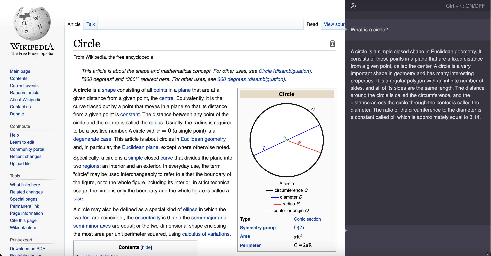

# Browser extension

This extension loads ChatGPT in the current tab, allowing you to use ChatGPT along your working session. Simply click
the extension icon in your browser toolbar to activate ChatGPT or use the shortcut `Ctrl + \`, and you can even customize shortcut in the `chrome://extensions/shortcuts`



## Latest Changes

- Display markdown
- Keep conversation context
- Automatically scroll

## Installation

Download and unzip the latest release from the [releases page](https://github.com/iOliverNguyen/chatgpt-extension/releases).

### Chrome
- Go to `chrome://extensions`
- Turn on developer mode.
- Click "Load unpacked".
- Select the `chrome` folder.

### Firefox

TODO

## Build from source

```sh
./build.sh
```

The output files will be created in the `build` directory.

## Related works

- https://github.com/wong2/chat-gpt-google-extension
